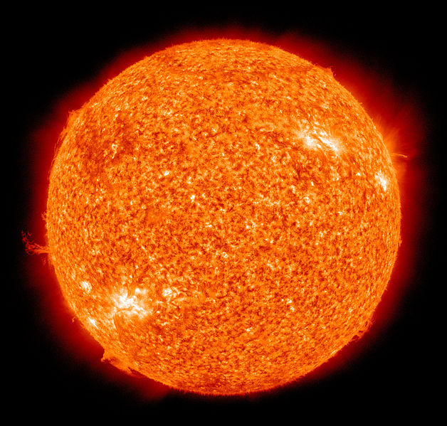
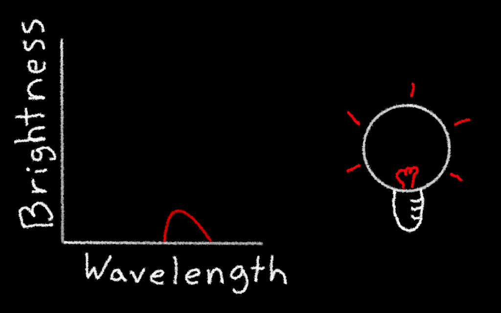
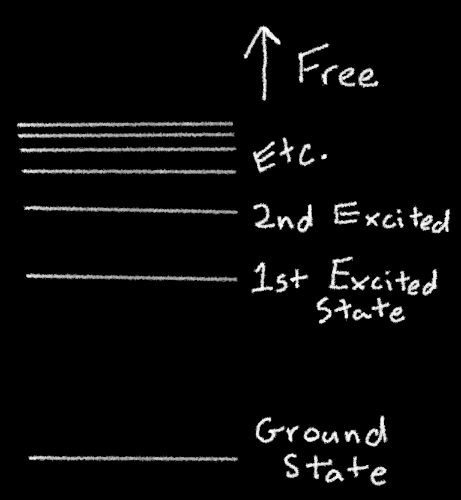
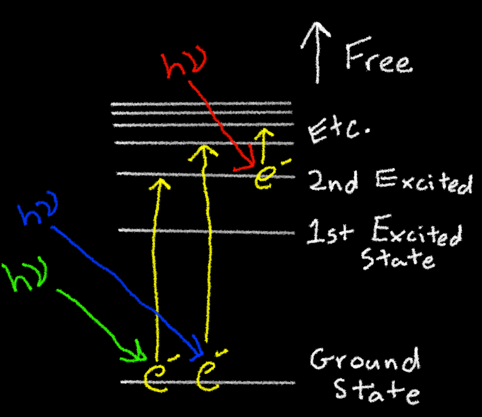
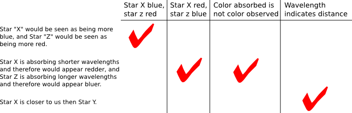
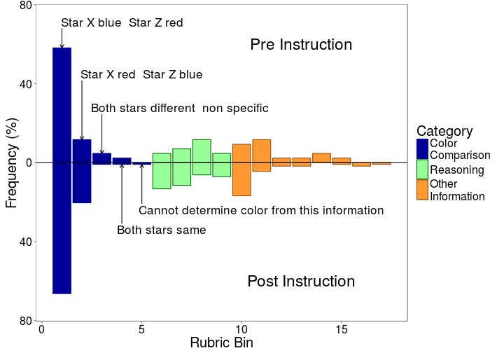
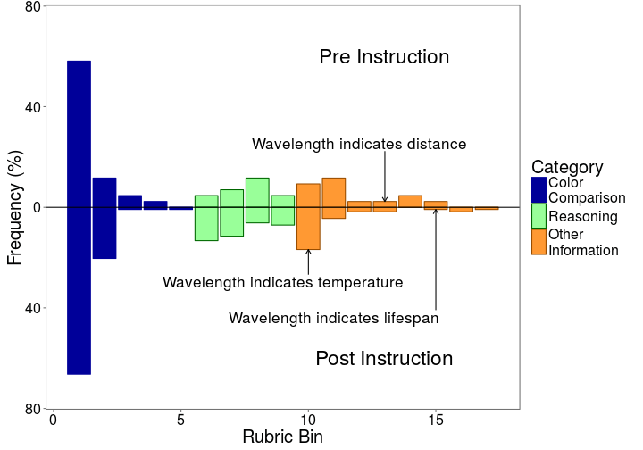
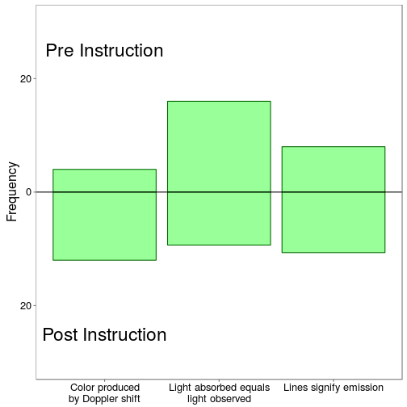

## But First, A Quick Review of Starlight

  

 NASA 

__Two major processes shape a stellar spectrum__
 - Thermal emission
 - Line absorption

--- .class1 #id1 bg:black

## Anatomy of a Star

  

--- .class1 #id1 bg:black

## Thermal Radiation

  

--- .class1 #id1 bg:black

## Thermal Radiation

  

--- .class1 #id1 bg:black

## Thermal Radiation

  

--- .class1 #id1 bg:black

## Anatomy of a Star

  

--- .class1 #id1 bg:black

## Quantized Energy Levels

  

--- .class1 #id1 bg:black

## Quantized Energy Levels

  

--- .class1 #id1 bg:black

## Quantized Energy Levels

  

--- .class1 #id1 bg:black

## Quantized Energy Levels

  

--- .class1 #id1 bg:black

## Quantized Energy Levels

  

--- .class1 #id1 bg:black

## Absorption Line Features

  

--- 

## Astronomy Assessment for AACR 
#### (AAAACR? ...probably not...hmmm...)
### Objective:
To develop a set of constructed response items probing student thinking on key concepts in astronomy

### Motivation:
 * A number of concept inventories exist covering topics in astronomy
     * Light and Spectroscopy Concept Inventory  (LSCI) (Bardar et al 2007)
     * Astronomy and Space Science Concept Inventory (Sadler et al 2010)
     * Test of Astronomy Standards (Slater et al 2011)
 * A set of constructed resoponse items can supplement these instruments by
     * Providing deeper examining of student thinking
     * Test problematic items

---
 

## Astronomy Assessment for AACR 
#### (American Association Adapting Astronomy Assessments for AACR: AAAAAAACR)
### Objective:
To develop a set of constructed response items probing student thinking on key concepts in astronomy

### Motivation:
 * A number of concept inventories exist covering topics in astronomy
     * Light and Spectroscopy Concept Inventory  (LSCI) (Bardar et al 2007)
     * Astronomy and Space Science Concept Inventory (Sadler et al 2010)
     * Test of Astronomy Standards (Slater et al 2011)
 * A set of constructed resoponse items can supplement these instruments by
     * Providing deeper examining of student thinking
     * Test problematic items

---
## The AACR Question Development Cycle

  

---

## The AACR QDC in Practice

  

--- &twocol 

## Light and Spectra

*** =left

  

 NASA, ESA, J. Hester, A. Loll (ASU) 

*** =right

__Light And Spectroscopy Concept Inventory__
 * Concept invetory on the production of electromagnetic spectra by astrophysical systems and their use studenting astronomical objects
 * Bardar et al. 2007

--- &twocol

## Selecting LSCI Items

  

 NASA, ESA and the Hubble SM4 ERO Team 

*** =left

__Goals__
 * Content coverage
 * Items for which CR can add depth
 * Investigate items with high post-difficulty, low post-discrimination (Schlingman et al. 2012)
 
*** =right
 
__Constraints__
 * Readily adaptable
 * Small number of items
 * Target automated analysis

--- &twocol

## The Items

*** =left

  

NASA, ESA

*** =right

__Emission line sources__
 * LSCI Item 21
 
__Source color and thermal emission with absorbtion features__
 * LSCI Item 2
 
__Comparing observed features to a known source__
 * LSCI Item 17

--- &twocol

## The Items

*** =left

  

NASA, ESA 

*** =right

__Emission line sources__
 * LSCI Item 21
 
__*Source color and thermal emission with absorbtion features*__
 * *LSCI Item 2*
 
__Comparing observed features to a known source__
 * LSCI Item 17

---

## LSCI Multiple Choice Version
 

  

 
Consider the dark line absorption spectra shown below for Star X and Star Z. What can you determine about the colors of the two stars? *Assume that the left end of each spectrum corresponds to shorter wavelengths (blue light) and that the right end of each spectrum corresponds with longer wavelengths (red light).*  
 a. Star X would appear blue and Star Z would appear red.   
 b. Star X would appear red and Star Z would appear blue.  
 c. Both stars would appear the same color.  
 d. The colors of the stars cannot be determined from this information.  

---

## LSCI Multiple Choice Version
 

  

 
Consider the dark line absorption spectra shown below for Star X and Star Z. What can you determine about the colors of the two stars? *Assume that the left end of each spectrum corresponds to shorter wavelengths (blue light) and that the right end of each spectrum corresponds with longer wavelengths (red light).*  
 *__a. Star X would appear blue and Star Z would appear red.__*   
 b. Star X would appear red and Star Z would appear blue.  
 c. Both stars would appear the same color.  
 d. The colors of the stars cannot be determined from this information.  

---

## LSCI Multiple Choice Version
 

  

 
Consider the dark line absorption spectra shown below for Star X and Star Z. What can you determine about the colors of the two stars? *Assume that the left end of each spectrum corresponds to shorter wavelengths (blue light) and that the right end of each spectrum corresponds with longer wavelengths (red light).*  
 a. Star X would appear blue and Star Z would appear red.   
 b. Star X would appear red and Star Z would appear blue.  
 c. Both stars would appear the same color.  
 *__d. The colors of the stars cannot be determined from this information.__*  

---

## Constructed Response Version
 

  

Consider the dark line absorption spectra shown below for Star X and Star Z. What can you determine about the colors of the two stars? Assume that the left end of each spectrum corresponds to shorter wavelengths (blue light) and that the right end of each spectrum corresponds with longer wavelengths (red light).

---
 
## The Test Data Set

__Introductory Astronomy__
 * 2 sections
 * N ~ 50, 150

__Administration__
 * Part of weekly homework
 * Pre-instruction ~ 40 responses
 * Post-instruction ~ 110 responses

--- &twocol

## The Exploratory Rubric Development

  

*** =left

__Rubric__
 - Analytic rubric
 - Constructed post-administration based solely or response content
 
*** =right

__Bins__
 - Fine grained concepts
 - Not mutually exclusive 
 - For convenience bins are grouped in categories

---

## The Expolaratory Rubric

 * 17 rubric bins
 * 3 categories of bins
     * Color comparison
     * Reasoning
     * Other information
 * All LSCI options reproduced by color comparison bins

---

## Star Color and Absorption Features

---

## Star Color and Absorption Features

---

## Star Color and Absorption Features

---

## Reasoning for "Star X is Blue"

---

## Item Summary and Conclusions

### Questions
 * Are students confused by item, forced to choose in face of lack of adequate information?
 * Why is "X is Blue, Z is Red" three times as popular as "X is Red, Z is Blue"?
 * Are the reasons in the test set representative of the entire population?
 
### (Tentative) Conclusions
 * Students struggle with the nature of absorption lines
 * Confusion resistant to instruction

--- &twocol

## Moving Forward

### Revise questions

  

Consider the dark line absorption spectra shown below for Star X and Star Z. What, *__if anything__*, can you determine about the colors of the two stars *__from these spectra__*? *__Explain your reasoning.__* Assume that the left end of each spectrum corresponds to shorter wavelengths (blue light) and that the right end of each spectrum corresponds with longer wavelengths (red light).

 
### Automation

*** =left
 * More data to build predictive models
*** =right
 * Develop predictive rubric

--- &twocol

## Acknowledgements

*** =left

### Thanks

The AACR Research Group

Particpant Instructors

### Grants
This material is based upon work supported by the National Science Foundation (Grants 0736952, 0909999, 1022653, 1323162, and 1347740). Any opinions, findings and conclusions or recommendations expressed in this material are those of the author(s) and do not necessarily reflect the views of the supporting agencies. 

*** =right

https://msu.edu/~aacr
